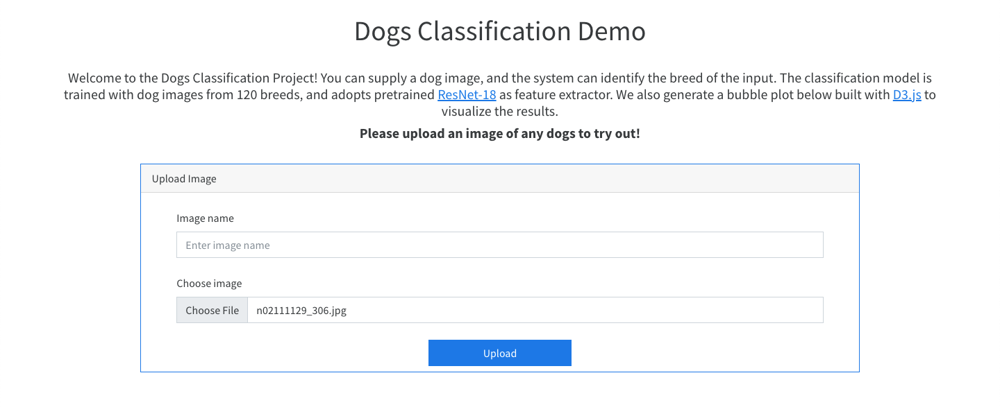
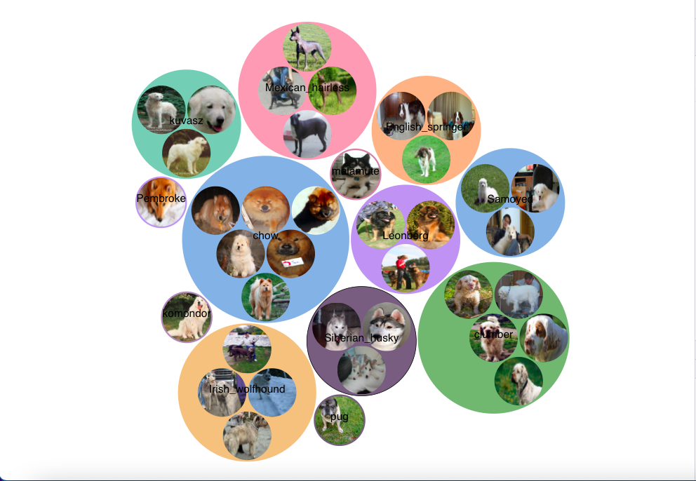
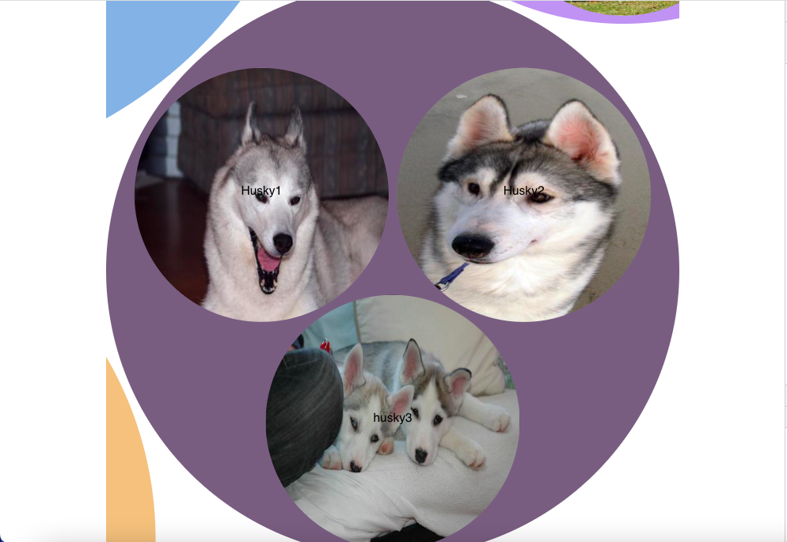

# Clustering_demo
The project can identify the breed of the dog images. The classification model is trained with dog images from 120 breeds, and adopts pretrained ResNet-18 as feature extractor. We also generate a bubble plot below built with D3.js to visualize the results. You can zoomin to any classes by clicking on it and zoomout by clicking on the background.

# This is a full stack project, you need to run both "backend" and "frontend" in the pip virtual environment to start the project
# Start pip environment
    pipenv shell

# Installing packages
    # in the backend folder
    cd backend
    pip install Django

    # in the frontend folder
    cd frontend
    npm install

# Create database
    # in the backend folder
    python manage.py makemigrations images
    python manage.py migrate
    # if you want to access the database in the administration page (http://127.0.0.1:8000/admin),you need to create a superuser account
    python manage.py createsuperuser

# Start the project
    # in the backend folder start the server
    python manage.py runserver
    # in the frontend folder run the react frontend
    npm run start

# Some references
    Upload images to Django database using a react form: https://medium.com/@emeruchecole9/uploading-images-to-rest-api-backend-in-react-js-b931376b5833
    D3 zoomable circle packing framework: https://observablehq.com/@d3/zoomable-circle-packing
    Bootswatch (free themes for Bootstrap): https://bootswatch.com/

